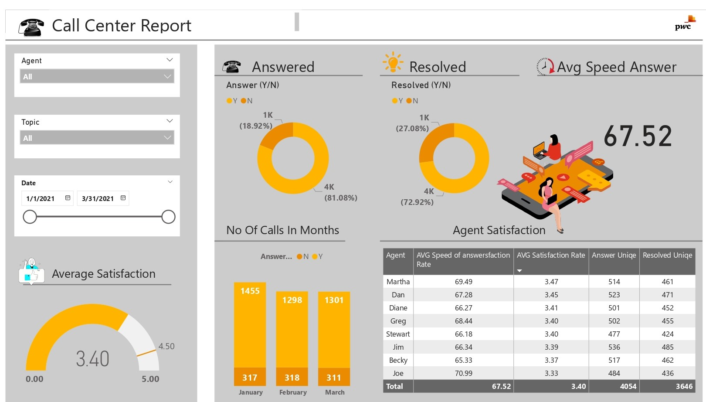

# Call Center Performance & Customer Satisfaction Dashboard

## Overview
This project analyzes Q1 2021 call center operations to evaluate customer service efficiency, call resolution, and individual agent performance. The goal was to transform raw call logs into actionable visual metrics using Power BI.

## Tools & Technologies
- **Power BI Desktop:** Data modeling, DAX calculations, and visual dashboard design
- **Power Query:** Data cleaning, type transformations, and formatting
- **Microsoft Excel:** Source dataset

---

## Key Metrics & Analysis

### 1. Overall Call Volume & Resolution
- **Total Call Volume:** Analyzed ~5,000 customer calls across January, February, and March 2021.
- **Answer Rate:** 81.08% of incoming calls were answered (4,054 calls), while 18.92% remained unanswered.
- **First Contact Resolution:** 72.92% of calls were successfully resolved.
- **Monthly Trend:** Call volume peaked in January (1,455 answered) and remained steady through February (1,298) and March (1,301).

### 2. Service Speed & Satisfaction
- **Average Satisfaction Rating:** 3.40 / 5.00 across all departments.
- **Average Speed of Answer:** 67.52 seconds.
- **Agent Highlights:**
  - **Jim** handled the highest call volume with 536 answered calls (485 resolved).
  - **Martha** achieved the highest customer satisfaction score at 3.47 / 5.00.
  - **Joe** recorded the longest average response time at 70.99 seconds.

---

## Dashboard Preview

---

## Key Takeaways
1. **Response Time:** An average wait time of ~67 seconds indicates potential staffing bottlenecks during peak hours.
2. **Agent Training:** Targeted coaching for agents with lower satisfaction scores (e.g., Joe at 3.33) could help lift overall team ratings closer to top performers like Martha.
